# Titanic ML - Classification

This example is based on actual data from the Titanic catastrophe. In this example a classification algorithm is built that is able to predict, if a fictual person would have survived the Titanic accident.

## Overview
1. [Prerequisites](#Prerequisites)
2. [Setup](#Setup)
3. [Get your Data in place](#GetyourDatainplace)
4. [Data Exploration](#DataExploration)
5. [Data Preparation](#DataPreparation)
6. [Develop the Model](#DeveloptheModel)
7. [Run your Python Script](#RunyourPythonScript)
8. [Check Results](#CheckResults)
9. [Deploy your Model](#DeployyourModel)
10. [Deploy the model in the cloud](#Deploythemodelinthecloud)

## <a name="Prerequisites"></a>Prerequisites
* Create an Azure Machine Learning Experimentation account.
* Azure Machine Learning Workbench installed

You can follow the instructions in the [Install and create Quickstart](https://docs.microsoft.com/en-us/azure/machine-learning/preview/quickstart-installation) article to install the Azure Machine Learning Workbench application.

## <a name="Setup"></a>Setup
1. Start of by cloning the [repository](https://github.com/starlord-daniel/AML-Labs) on your local machine.
2. The files needed for the experiment are located under **1-AML-Titanic**
3. Open **Azure Machine Learning Workbench** and add the project to your workspace

    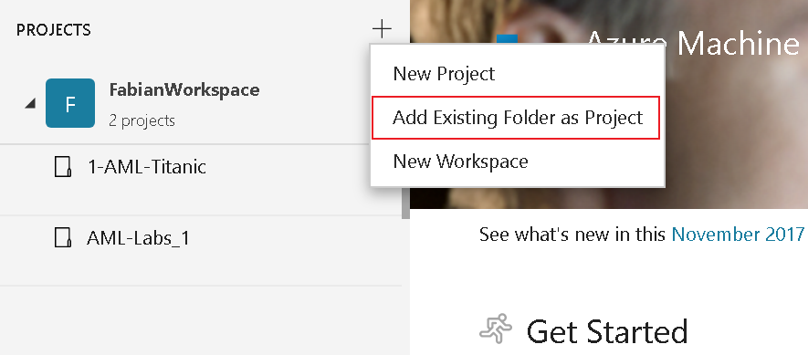
    
    **If it is not possible to add the folder, please copy just the Titanic example to a different folder**
4. Fill in the **Project name** and **Project directory** boxes. **Project description** is optional but helpful. Leave the Visualstudio.com GIT Repository URL box blank for now and choose a workspace (created in the [installation guide](https://docs.microsoft.com/en-us/azure/machine-learning/preview/quickstart-installation)).

After setting up your project you should see the dashboard of the project.

## <a name="GetyourDatainplace"></a>Get your Data in place
Preparing the data is one of the key steps for your first ML experiment. This step includes renaming of columns, filtering (e.g. removing *null* val]ues), transforming values and changing the data type.

- To begin the process, add your dataset [**titanic.csv**](data/titanic-dataset.csv) as a new Data Source to the experiment and follow the steps.

    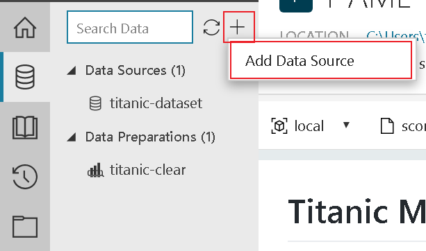

    (**Please note:** The project you cloned already has a fully prepared dataset included. However, to get a glimpse of how things work we recommend to try it out on your own.)

## <a name="DataExploration"></a>Data Exploration
In the **titanic.csv** file you can find the data imported and used in the model creation. Before we get started with preparing the data for the experiment, let's have a quick look at what the data is about.

| Variable | Definition | Type |
| ------------- |-------------| -----|
| survival | Survival | Boolean, 0 = no, 1 = yes |
| pclass | Ticket class |  Decimal, 1 = 1st, 2 = 2nd, 3 = 3rd |
| sex | Sex | Male or Female as string|
| Age | Age in years | Decimal |
| sibsp | # of siblings / spouses aboard the Titanic | Decimal|
| parch | # of parents / children aboard the Titanic | Decimal|
| ticket | Ticket number | String |
| fare | Passenger Fare | Decimal |
| cabin | Cabin number | string |
| embarked | Port of Embarkation | C = Cherbourg, Q = Queenstown, S = Southampton |
| boat | # of life boat if survived | string |
| body | # of body if dead | Decimal |

To get to know your data even better by exploring certain statistical figures click on **Metrics** in the top bar of the data section:

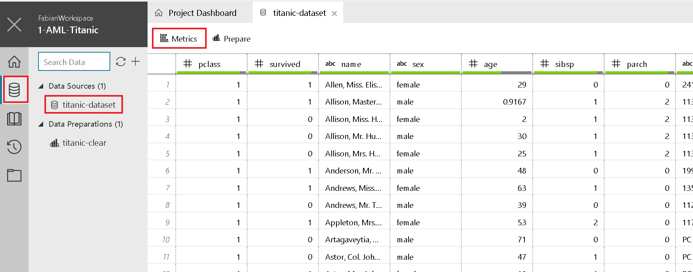

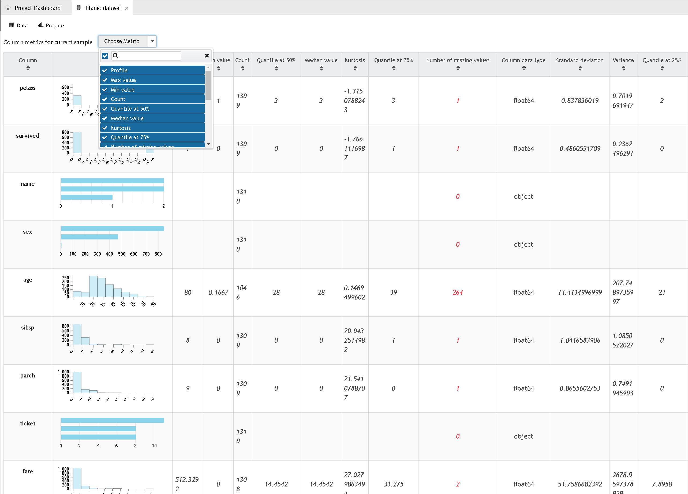

### <a name="DataPreparation"></a>Data Preparation
Now it's time to get our hands dirty and prepare our data. The following steps are about getting rid of data we don't need, removing incomplete data and transforming data types, but let's take one step after the other:

1. To start off, create a new Preparation file

    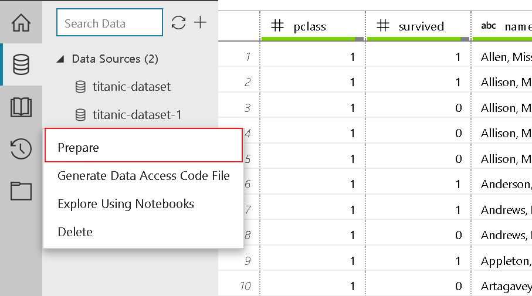

2. Select the Prepare button. The Prepare dialog box opens. 
    - The sample project comes with an titanic-clear.dprep file. By default, it asks you to create a new data flow in the titanic-clear.dprep data preparation package that already exists. 
    - Select + New Data Preparation Package from the drop-down menu, enter a new value for the package name, use titanic-clear-1, and then select OK.
3.  Let's start with removing the columns we don't need. Therefore select the column "**name**" and click "remove". (right-click on the column head)
    - Repeat this for the columns **ticket, embarked, cabin, boat, body** and **home.dest**
4. Next we filter the pclass for empty values

    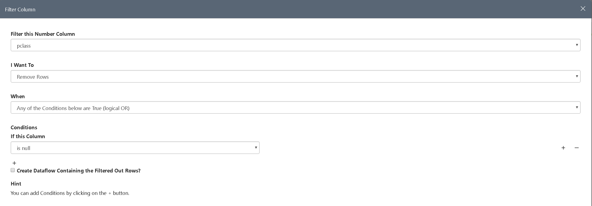

    - Repeat this for the columns **fare** and **age**
5. We also want **sex** to be a numeric value (female = 1, male = 0). To do so, we have to select "Replace Values". This is necessary due to limitations the Machine Learning algorithms dictate

    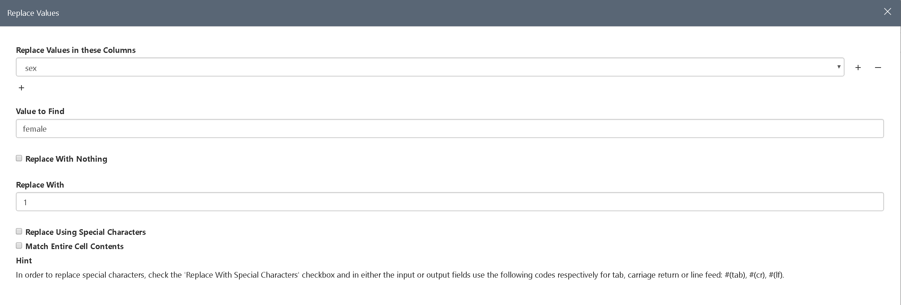

    - Repeat this for male.
    - To make **sex** a numeric value we only have to click on the column header and select the **numeric** option.
6. Last but not least, we want to change the precision of the columns **age** and **fare**.

7. Info

    - The Azure Machine Learning Workbench shows you all the steps you performed in the **Steps** pane on the right side. There you can edit and revert to early stages. 

    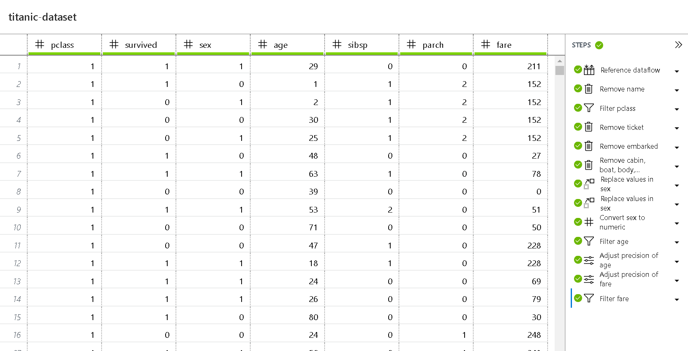

    - Here you can view, change and edit single steps performed during the preparation process.
    - The result of the above-mentioned steps should be the same as the dataset prepared in the demo.

    - For more information on how to prepare data in Azure Machine Learning Workbench, see the [Get started with data preparation guide](https://docs.microsoft.com/en-us/azure/machine-learning/preview/data-prep-getting-started).

## <a name="DeveloptheModel"></a>Develop the Model
At this stage we have our data sources configured and prepared for the fun part you've probably been waiting for - developing the ML model.
To make things a little bit easier, we already added the [train.py](train.py) file to the project. Open the file and try to make yourself familiar with the code.
Basically the script performs the following steps:

- Loads the data preparation package titanic-clear.dprep to create a [pandas DataFrame](https://pandas.pydata.org/pandas-docs/stable/generated/pandas.DataFrame.html).
- Splits the dataset into a training and a testing set ( 65% / 35% )
- Uses the scikit-learn machine learning library to build a logistic regression model. 
- Serializes the model by inserting the pickle library into a file in the outputs folder. 
- The run_logger object is used throughout to record the model accuracy into the logs. The logs are automatically plotted in the run history.

```python
print ("Export the model to model.pkl")
f = open('./outputs/model.pkl', 'wb')
pickle.dump(classification_model, f)
f.close()
```

The deserialized model, saved in the ouputs folder, can later be used to make a prediction on a new record but first things first.

### <a name="RunyourPythonScript"></a>Run your Python Script
We are now ready to run the script on your local computer. 
- Select **local** as the execution target from the command bar near the top of the application, and select **train.py** as the script to run. There are other files included in the sample that we will check out later. 

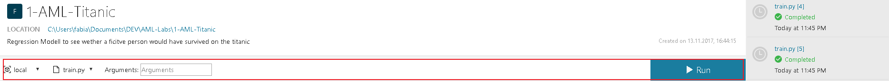

- Click the Run button to begin running train.py on your computer. 
- The Jobs panel slides out from the right if it is not already visible, and an train job is added in the panel. Its status transitions from Submitting to Running as the job begins to run, and then to Completed in a few seconds. 
- **Congratulations.** You have successfully executed a Python script in Azure Machine Learning Workbench.

### <a name="CheckResults"></a>Check Results
After running the script 2-3 times feel free to check the results in the Jobs History.

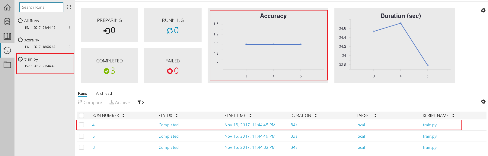

Accuracy shows you how accurate your script works.
The list of Jobs below show a historical list of the scrips you ran. By selecting one job you get a detailed overview.

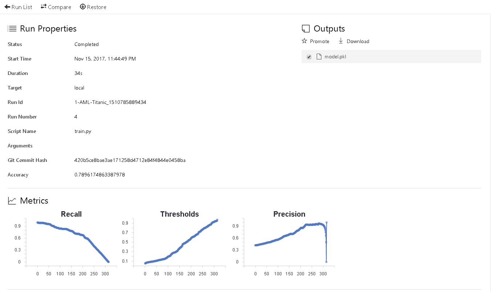

## <a name="DeployyourModel"></a>Deploy your Model
Before we can think about deploying our experiment we have to figure out, if our model actually works. Therefor, it is important to download and save the model, created by our train.py script. The model.pkl file is saved in the output section of the log.


This file is used in our second script - [**score.py**](score.py). This file loads the model.pkl and tests it against predefined test data. The result is a JSON-Object. You can find it in the Jobs history under the score.py section. Selecting a certain Job in the list will take you to a detailed overview. 

To publish the model, we have to perform these actions:
1. Run the score.py file, which creates a json file, that contains the schema for your input
2. save the service_schema.json in the root of your project (same location as train.py)
3. open your command prompt in the AML Workbench (To left option: File -> Open Command Prompt )
4. Take a look at the [Prepare to operationalize locally section of the official documentation](https://docs.microsoft.com/en-us/azure/machine-learning/preview/tutorial-classifying-iris-part-3#prepare-to-operationalize-locally) 
5. After the preparation, you can create the real-time web service in one command:

    ```sql
    az ml service create realtime -f score_iris.py --model-file model.pkl -s service_schema.json -n irisapp -r python --collect-model-data true
    ```
    - after deployment, the service will provide you with options to call you service


## [Optional] <a name="Deploythemodelinthecloud"></a>Deploy the model in the cloud

To upload the docker file to Azure, we just have to create a Web Service for Containers in Azure. As the last command (deploy web service in one command) created a Docker image and also an Azure Container Registry, this is fairly easy to do:

1. Log in to the Azure portal and search for "Web App for Containers"

2. Create the Web App and configure your container. This is quite staightforward, as you just have to choose the one, that is already created for you.

    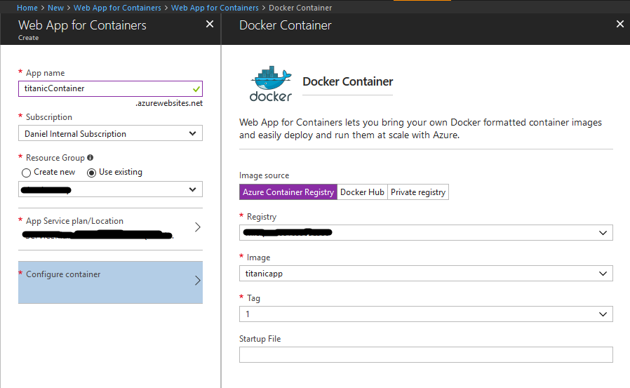

3. Save the settings and create the service

4. After setting up the service, wait some time (depending on model size) until it is ready. Now you can call it via HTTP. You can use this [Jupyter notebook](titanic-classify.ipynb) to guide you through the call.

5. [Optional]: Set the Always On option in the Application Settings of your App Service to "On". This way, the it is always ready and will not shut down, when unused.


## Summary:

What we did: 
* Setup Azure Machine Learning Workbench
* Created a project
* Added a new Data Source
* Prepared the data in order to be able to process it
* Ran your first training scripts and created a model
* Used the model to test your data and classify it
* Deployed your model on our machine (and as a web service)

